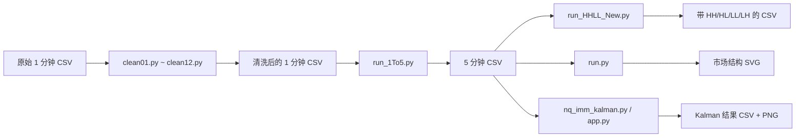

# NQ Kalman 数据清洗与市场结构分析

本项目用于处理 Nasdaq-100 E-mini（NQ）分钟级 OHLCV 数据，提供以下能力：

- 对 Databento 风格的一分钟 CSV 执行 12 步数据清洗与审计；
- 将一分钟 K 线聚合为五分钟 K 线；
- 标注 Higher High（HH）、Higher Low（HL）、Lower High（LH）、Lower Low（LL）；
- 生成市场结构、趋势、支撑位和阻力位 SVG 图表；
- 计算双模型、7 阶 IMM-Kalman 与 CSS 方向指标；
- 通过 Gradio 网页界面上传 CSV、筛选数据并下载指标结果。

> 本项目输出的是数据分析结果，不构成任何投资建议。处理真实交易数据前，请先备份原始文件，并检查各步生成的拒绝记录和审计文件。

## 项目处理流程



各脚本都从命令执行时的当前目录解析命令行相对路径。`config.json` 内的相对路径则以该配置文件所在目录为基准。建议始终在项目根目录运行命令。

## macOS 部署

### 1. 安装 Python

项目使用了 Python 3.10 及以上版本的语法，建议使用 Python 3.11 或 3.12。先确认版本：

```bash
python3 --version
```

如果尚未安装，可通过 Homebrew 安装：

```bash
xcode-select --install
brew install python@3.12
```

如果系统中还没有 Homebrew，请先按照 [Homebrew 官方网站](https://brew.sh/) 的说明安装。

### 2. 创建虚拟环境并安装依赖

```bash
cd /path/to/NQ_Kalman
python3 -m venv .venv
source .venv/bin/activate
python -m pip install --upgrade pip
python -m pip install -r requirements.txt
```

`clean01.py`～`clean12.py`、`compare.py`、`run.py`、`run_1To5.py` 和两个 HHLL 脚本只使用 Python 标准库。以下功能需要 `requirements.txt` 中的第三方库：

- `nq_imm_kalman.py`：NumPy、pandas、Matplotlib；
- `app.py`：上述依赖以及 Gradio。

以后重新进入项目时，只需激活环境：

```bash
cd /path/to/NQ_Kalman
source .venv/bin/activate
```

## 数据格式要求

### 原始一分钟数据：完整清洗链

默认清洗入口是项目根目录下的 `raw-1m.csv`，也可以在 `config.json` 中修改 `input_path`。CSV 应使用英文逗号分隔，推荐保存为无 BOM 的 UTF-8，并包含表头。

必需字段如下：

| 字段 | 要求 | 示例 |
| --- | --- | --- |
| `ts_event` | UTC ISO 8601 时间；必须以 `Z` 结尾，可有 1～9 位小数秒；必须精确对齐到整分钟 | `2026-07-20T14:35:00.000000000Z` |
| `rtype` | 不可为空；清洗链不进一步解释该字段 | `33` |
| `publisher_id` | 不可为空，作为合约分组键的一部分 | `1` |
| `instrument_id` | 不可为空，作为合约分组键的一部分 | `12345` |
| `open` | 有限正数，且符合 OHLC 关系和 NQ 的 0.25 点价格网格 | `22500.25` |
| `high` | 有限正数，且 `high >= max(open, close)` | `22505.00` |
| `low` | 有限正数，且 `low <= min(open, close)` | `22498.75` |
| `close` | 有限正数，且符合 0.25 点价格网格 | `22503.50` |
| `volume` | 非负整数；零成交量允许，但会被标记 | `128` |
| `symbol` | NQ 单腿季度合约代码，格式为 `NQ` + `H/M/U/Z` + 1～2 位年份数字 | `NQU6` |

示例：

```csv
ts_event,rtype,publisher_id,instrument_id,open,high,low,close,volume,symbol
2026-07-20T14:35:00.000000000Z,33,1,12345,22500.25,22505.00,22498.75,22503.50,128,NQU6
```

补充说明：

- `config.json` 默认只接受 `2010-06-06 22:00:00+00:00` 至 `2026-07-20 23:59:00+00:00` 的时间，可根据数据下载区间修改；
- `H`、`M`、`U`、`Z` 分别表示 3 月、6 月、9 月、12 月季度合约；价差、期权和其他品种会在第三步被隔离；
- 如果 CSV 额外包含 `instrument_class` 或 `security_type`，第三步会优先参考它们识别期货和期权；
- 额外字段通常会被原样保留；
- `clean04.py` 会按 `publisher_id`、`instrument_id`、`symbol`、`ts_utc` 排序，因此原始文件不必预先排序；
- 第二步会把 `ts_event` 改名并规范化为 `ts_utc`，格式为 `YYYY-MM-DD HH:MM:SS+00:00`。

### 五分钟聚合输入

`run_1To5.py` 至少要求以下字段：

```text
ts_utc, open, high, low, close, volume
```

其中 `ts_utc` 应为带时区的时间，例如 `2026-07-20 14:35:00+00:00`。如果存在 `publisher_id`、`instrument_id`、`symbol`，脚本会将它们共同作为分组键，防止不同合约被聚合到同一根 K 线中。其他字段取该五分钟区间第一条真实记录的值。

五分钟 OHLCV 的聚合规则为：

- 时间：向下取整到五分钟；
- `open`：区间第一条记录；
- `high`：区间最大值；
- `low`：区间最小值；
- `close`：区间最后一条记录；
- `volume`：区间成交量之和。

脚本会检查排序；若输入未排序，会使用磁盘临时文件进行外部排序。处理大型 CSV 时，请确保 macOS 的系统临时目录和输出磁盘有足够空间。

### HH/HL/LL/LH 标注输入

`run_HHLL.py` 和 `run_HHLL_New.py` 至少要求可解析为有限数值的 `high`、`low` 字段。若存在 `publisher_id`、`instrument_id`、`symbol`，同一合约的记录必须连续排列；建议使用 `clean04.py` 或 `run_1To5.py` 的输出。

标注使用前后各 5 根 K 线的严格摆动窗口：

- 高点高于窗口内其他所有 `high`，才可能成为摆动高点；
- 低点低于窗口内其他所有 `low`，才可能成为摆动低点；
- 连续同类摆动点仅保留更极端者，然后与上一同类摆动点比较；
- 新增字段为 `Higher_Low`、`Higher_High`、`Lower_Low`、`Lower_High`，取值为 `0` 或 `1`；
- 同一行最多只有一个结构字段为 `1`。

`run_HHLL.py` 会从输出中删除 `symbol`、`zero_volume_flag`、`rtype`、`publisher_id`、`instrument_id`；`run_HHLL_New.py` 会保留全部原字段，通常建议使用后者。

### 市场结构图和 Kalman 输入

`run.py` 与 `nq_imm_kalman.py` 可以直接读取常见 OHLC CSV：

- 时间字段可使用 `ts_utc`、`ts_event`、`timestamp`、`datetime`、`date_time`、`time` 或 `date`；
- 价格字段支持 `open/high/low/close`，也支持 `o/h/l/c`，收盘价还支持 `last`；
- Kalman 的成交量字段可使用 `volume`、`vol` 或 `size`，缺失时按 `1` 处理；
- `volume` 和 `symbol` 对 Kalman 都是可选字段；
- OHLC 必须能转换为数值，并满足 `low <= min(open, close) <= max(open, close) <= high`；
- 同一时间有多条有效记录时，保留文件中最后一条；
- 未指定 `--symbol` 时，程序自动选择全文件中时间最新记录所属的合约组。

## 使用流程

### 方式一：运行完整数据管线

1. 将原始数据保存为项目根目录下的 `raw-1m.csv`，或修改 `config.json` 中的路径和规则。
2. 依次执行 12 个清洗步骤：

```bash
for step in {1..12}; do
  python "clean$(printf '%02d' "$step").py"
done
```

默认最终文件为：

```text
clean_csv/raw_1m_clean01_clean02_clean03_clean04_clean05_clean06_clean07_clean08_clean09_clean10_clean11_clean12.csv
```

3. 聚合为五分钟 K 线：

```bash
python run_1To5.py \
  -i clean_csv/raw_1m_clean01_clean02_clean03_clean04_clean05_clean06_clean07_clean08_clean09_clean10_clean11_clean12.csv \
  -o 5min/raw_clean12.csv
```

4. 添加 HH/HL/LL/LH 标记，并保留全部原字段：

```bash
python run_HHLL_New.py \
  -i 5min/raw_clean12.csv \
  -o 5min/raw_clean12_HHLL_New.csv
```

5. 生成最近 240 根 K 线的市场结构图：

```bash
python run.py \
  -i 5min/raw_clean12.csv \
  -o Data_view \
  --bars 240
```

可通过 `--symbol NQU6` 指定合约，通过 `--left` 和 `--right` 调整摆动点左右确认窗口。输出文件名类似：

```text
Data_view/market_structure_20260723_134131_0001.svg
```

6. 计算最近 10,000 根 K 线的 IMM-Kalman 指标并生成图表：

```bash
python nq_imm_kalman.py \
  -i 5min/raw_clean12.csv \
  -o Data_view/nq_kalman.csv \
  --tail 10000 \
  --chart Chart/nq_kalman.png
```

可选参数：

| 参数 | 作用 |
| --- | --- |
| `--symbol NQU6` | 只处理指定合约；匹配区分大小写 |
| `--start TIME` | 仅保留不早于该时间的记录 |
| `--end TIME` | 仅保留不晚于该时间的记录 |
| `--tail N` | 仅计算筛选后最近 N 根 K 线，N 至少为 2 |
| `--velocity-observation` | 速度观测方式：`blend`、`midpoint`、`ohlc4`、`clv` |
| `--atr-scale` | ATR 缩放方式：`squared` 或 `linear` |
| `--no-adaptive-r` | 关闭创新自适应观测噪声 |
| `--no-corrector` | 关闭 CSS Cascade Fingerprint 翻转校正 |

Kalman 结果会保留所选 K 线，并追加以下主要字段：

| 字段 | 含义 |
| --- | --- |
| `atr_14` | 14 周期 ATR |
| `velocity_observation`、`velocity_ema_5` | 速度观测值与 5 周期 EMA |
| `position`～`pop` | 7 阶滤波状态：位置、速度、加速度、jerk、snap、crackle、pop |
| `mu_mv`、`mu_ma` | 趋势模型（MV）和反转模型（MA）的 IMM 概率 |
| `observation_trust` | 当前观测可信度 |
| `r_price_inflation`、`r_velocity_inflation` | 自适应观测噪声膨胀系数 |
| `css_direction` | CSS 方向：`1` 多头、`-1` 空头、`0` 中性 |
| `css_count` | 当前 CSS 方向已持续的 K 线数 |
| `css_raw` | 级联翻转校正前的方向 |
| `fingerprint_6bit` | 高阶状态符号编码，范围 0～63 |
| `bull_flip`、`bear_flip` | 多头/空头翻转信号，取值 0 或 1 |

### 方式二：启动网页界面

```bash
python app.py
```

终端会显示本地访问地址，通常为 `http://127.0.0.1:7860`。在浏览器中打开后：

1. 上传包含时间和 OHLC 字段的 CSV；
2. 可选填合约代码、起止时间和最近 K 线数；
3. 选择速度观测、ATR 缩放和校正选项；
4. 点击“运行计算”；
5. 查看图表和最近 200 行预览，并下载结果 CSV。

网页界面默认把结果 CSV 写入 `Data_view/`，把 PNG 写入 `Chart/`。页面中的输出目录可以修改；相对目录以启动 `app.py` 时的当前目录为基准。

### 单独运行某个清洗步骤

`clean02.py`～`clean12.py` 均支持用 `-i` 和 `-o` 覆盖默认路径，例如：

```bash
python clean07.py \
  -i /path/to/input.csv \
  -o /path/to/output.csv \
  --config config.json
```

`clean01.py` 的输入、输出和必填字段只从配置文件读取：

```bash
python clean01.py --config config.json
```

### 比较两个 CSV

```bash
python compare.py first.csv second.csv
```

比较按完整记录进行，不要求两份文件的记录顺序相同，并会正确统计重复记录的数量差异；两份文件的表头及字段顺序必须一致。

## 12 步清洗说明

每一步的主输出会自动作为下一步的默认输入。多数隔离文件会在原字段末尾增加 `reject_reason`。

| 步骤 | 脚本 | 处理内容 | 附加输出 |
| --- | --- | --- | --- |
| 1 | `clean01.py` | 删除任一必填字段为空的记录 | 无 |
| 2 | `clean02.py` | 校验 Databento UTC 时间、整分钟对齐和配置的时间范围；将 `ts_event` 规范化为 `ts_utc` | `*_rejects.csv` |
| 3 | `clean03.py` | 只保留 NQ 单腿季度期货，隔离其他品种、价差、期权和无效代码 | `*_rejects.csv` |
| 4 | `clean04.py` | 使用 SQLite 按完整合约键和时间排序，统计组内重复分钟与分钟缺口 | `*_group_audit.csv` |
| 5 | `clean05.py` | 在同一合约和分钟内隔离完全相同的 OHLCV 重复记录，并审计 instrument 与 symbol 的映射冲突 | `*_duplicates.csv`、`*_symbol_conflicts.csv` |
| 6 | `clean06.py` | 对同一 `publisher_id`、`instrument_id` 和分钟中 OHLCV 不一致的冲突组，隔离该组全部记录 | `*_conflicts.csv` |
| 7 | `clean07.py` | 隔离空值、非数值、无穷值、NaN 和非正 OHLC | `*_price_rejects.csv` |
| 8 | `clean08.py` | 隔离不满足 OHLC 高低边界关系的记录 | `*_ohlc_rejects.csv` |
| 9 | `clean09.py` | 按配置的 0.25 tick 和容差检查全部 OHLC | `*_tick_rejects.csv` |
| 10 | `clean10.py` | 隔离无效、负数或非整数成交量 | `*_volume_rejects.csv` |
| 11 | `clean11.py` | 追加 `zero_volume_flag`；保留零成交量并再次防御性隔离负成交量 | `*_negative_volume_rejects.csv` |
| 12 | `clean12.py` | 完整保留数据；按合约比较相邻收盘价，将绝对涨跌幅达到阈值的记录写入人工审计表 | `Large_up_down.csv` |

常见 `reject_reason` 包括 `INVALID_TIMESTAMP`、`TIMESTAMP_OUT_OF_RANGE`、`FUTURES_SPREAD`、`OPTION_INSTRUMENT`、`EXACT_DUPLICATE`、`CONFLICT_DUPLICATE`、`INVALID_PRICE`、`INVALID_OHLC`、`INVALID_TICK_SIZE`、`INVALID_VOLUME` 和 `NON_INTEGER_VOLUME`。

## 每个 Python 文件的作用

| 文件 | 作用 |
| --- | --- |
| `app.py` | Gradio 网页入口：上传、筛选并运行 IMM-Kalman，输出状态、PNG、CSV 和最近 200 行预览。 |
| `clean01.py` | 清洗第 1 步：删除必填字段为空的行。 |
| `clean02.py` | 清洗第 2 步：严格校验 `ts_event`，生成规范化的 `ts_utc`。 |
| `clean03.py` | 清洗第 3 步：仅保留 NQ 单腿季度期货合约。 |
| `clean04.py` | 清洗第 4 步：用临时 SQLite 对大文件排序并生成合约时间连续性审计。 |
| `clean05.py` | 清洗第 5 步：隔离完全重复记录并输出 symbol 一致性审计。 |
| `clean06.py` | 清洗第 6 步：隔离同一合约、同一分钟内数值互相冲突的记录。 |
| `clean07.py` | 清洗第 7 步：校验 OHLC 是有限正数。 |
| `clean08.py` | 清洗第 8 步：校验 OHLC 的高低边界关系。 |
| `clean09.py` | 清洗第 9 步：校验价格是否落在 NQ 的 0.25 点网格上。 |
| `clean10.py` | 清洗第 10 步：校验成交量为非负整数。 |
| `clean11.py` | 清洗第 11 步：新增零成交量标志。 |
| `clean12.py` | 清洗第 12 步：输出大涨大跌人工审计表。 |
| `compare.py` | 借助临时 SQLite 比较两个 CSV 的完整记录集合和重复次数，不受记录顺序影响。 |
| `run_1To5.py` | 将一分钟 OHLCV 按合约聚合为五分钟 K 线；大文件支持磁盘外部排序。 |
| `run_HHLL.py` | 标注四类市场结构，但会删除合约标识、`rtype` 和零成交量标志。 |
| `run_HHLL_New.py` | 标注四类市场结构并完整保留输入字段，建议优先使用。 |
| `run.py` | 识别 ZigZag 摆动、当前趋势、支撑阻力和突破事件，生成无第三方前端依赖的 SVG 图表。 |
| `nq_imm_kalman.py` | 实现双模型 7 阶 IMM-Kalman、CSS 方向和级联翻转校正，输出指标 CSV 及可选 PNG。 |

## 配置文件

`config.json` 控制 12 步清洗的默认路径与规则。常用配置项：

| 配置项 | 说明 |
| --- | --- |
| `input_path`、`output_path` | 第一步的原始输入和清洗输出 |
| `required_columns` | 第一步判空的必填列 |
| `encoding` | 清洗链读写编码，默认 `utf-8` |
| `clean02.download_start_utc`、`download_end_utc` | 合法下载时间范围 |
| `clean04.group_columns` | 排序与时间审计使用的合约键 |
| `clean09.tick_size`、`tick_tolerance` | NQ 最小价格跳动及判断容差 |
| `clean12.return_threshold_pct` | 大涨大跌审计阈值，默认绝对涨跌幅 1% |
| 各步 `default_input_path`、`default_output_dir` | 默认输入文件和输出目录 |

如果在 `config.json` 中使用相对路径，它们始终相对于 `config.json` 所在目录，而不是当前终端目录。

## 输出目录

| 路径 | 内容 |
| --- | --- |
| `clean_csv/` | 12 步清洗的主输出、拒绝记录和审计记录 |
| `5min/` | 五分钟聚合结果及 HH/HL/LL/LH 标注结果 |
| `Data_view/` | 市场结构 SVG 与 Kalman 指标 CSV |
| `Chart/` | Kalman PNG 图表 |
| `input/`、`output/` | 手工或其他批处理流程使用的输入、输出目录 |

这些目录中的数据和图表可能非常大，项目提供的 `.gitignore` 默认不会将 CSV、PNG、SVG、临时数据库、缓存和虚拟环境提交到 Git。如需提交小型示例数据，可使用 `git add -f path/to/example.csv`，或按团队约定调整 `.gitignore`。

## 常见问题

### `ModuleNotFoundError: No module named ...`

确认已经激活虚拟环境并安装依赖：

```bash
source .venv/bin/activate
python -m pip install -r requirements.txt
```

### 时间格式校验失败

完整清洗链的原始时间必须类似 `2026-07-20T14:35:00.000000000Z`，并且秒和纳秒均为零。若数据区间超出 `config.json` 的默认范围，也会被第二步隔离。

### 后续步骤提示“请先运行 clean04.py”

第五步和第十二步依赖合约键与时间顺序。请不要跳过第四步，或者确保自定义输入已经按 `publisher_id`、`instrument_id`、`symbol`、`ts_utc` 升序排列。

### 自动选择了错误合约

`run.py` 和 `nq_imm_kalman.py` 默认选择最新时间记录所属的合约。使用 `--symbol` 显式指定，例如：

```bash
python nq_imm_kalman.py -i 5min/raw_clean12.csv -o Data_view/nqu6.csv --symbol NQU6
```

